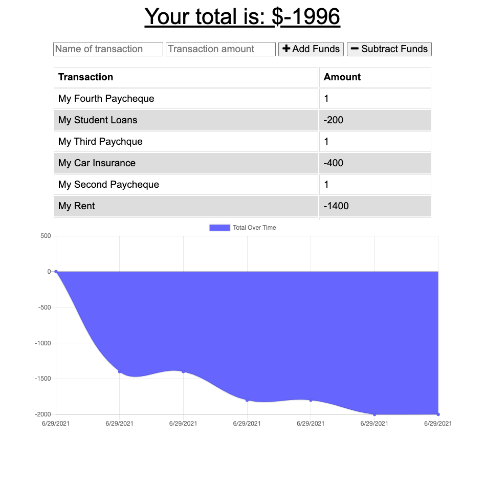

# Budget Tracker

This application allows the user to input positive and negative transactions from to their budget. All transactions are saved in a MongoDB database, and IndexedDB is used to manage requests sent when the application is offline.

The application is deployed here: https://sheltered-river-01501.herokuapp.com/

The following tools & packages were used for development:

- Mongoose
- Express
- Node.js
- IndedexedDB

## Application Functionality

The application is able to perform the following functions:

- Take user inputs for transaction name and amount and either adds or subtracts the value from the current budget amount.
- Manage transactions entered while offline so that they are entered in the database when connection is regained.
- Provide a web app manifest for users to download the application.
- Cache key files and images for offline access and faster reloading.

## Screenshot

Here is a screenshot of the deployed site!

## References

- Mongoose: https://mongoosejs.com/
- Express: https://expressjs.com/
- Node.js: https://nodejs.org/en/
